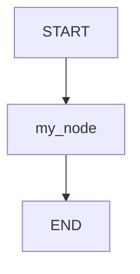
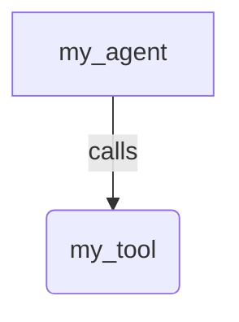

# Sample README structure

Two kinds of README, with different readers. Every sample directory has one, and
every category directory has one.

| README                                | Reader                                                                           |
| ------------------------------------- | -------------------------------------------------------------------------------- |
| `samples/{category}/{name}/README.md` | Someone who has landed on this one sample and wants to run it and understand it. |
| `samples/{category}/README.md`        | Someone browsing the category, deciding which sample to open.                    |

The per-sample README is new. None of the 26 samples that predate this skill has
one, so this file is the reference and the neighbouring directories are not. The
category README already exists for `samples/workflows/`, which is the worked
example for the second half of this file.

## Per-sample README

Sections in this order. Omit one only when the sample gives you nothing to put
in it.

### Overview

What the sample does and which feature or pattern it exists to demonstrate. Two
or three sentences. This repeats the first stanza of the `agent.ts` header
comment on purpose, because a reader who arrived at the directory has not opened
the code yet.

### Sample Inputs

Prompts a reader can paste in to exercise the sample. Wrap each prompt in
backticks. If a prompt needs an explanation, leave a blank line between the
prompt and the explanation and indent the explanation by two spaces — without
the blank line Markdown folds them into one list item.

Pick prompts that reach the feature the sample is about. A prompt the agent
answers without calling the tool teaches the reader nothing about the tool.

### Graph

A Mermaid diagram of the structure, not of the request and response flow.

- For a `Workflow` root agent, draw the nodes and the edges.
- For an agent that orchestrates tools or sub-agents, draw the topology of the
  agent and what hangs off it.

Include the diagram when the topology is not already obvious from the code. A
`Workflow` whose `edges` array reads as the picture does not need one — the
array is the diagram, and a second copy of it drifts. An `LlmAgent` with tools
or sub-agents has no `edges` array at all, so its topology is written down
nowhere else, and the diagram is the only place a reader sees it whole.

Keep it to a few nodes and edges. A `user -> agent -> API -> tool -> user`
sequence diagram is noise: it says nothing the topology does not.

### How To

The key techniques the sample uses, with the few lines of code that show each
one. This is the section that answers "what do I copy into my own project", so
name the technique, then show it in the sample's own code rather than in a
paraphrase of it.

### Related Guides

Links to the guides under `docs/guides/` that explain the classes the sample
uses, each with a one-line summary. Link by relative path, and count the `../`
from the sample's own directory: from `samples/{category}/{name}/README.md` the
repository root is three levels up, and from a sample in a nested category such
as `samples/workflows/{group}/{name}/README.md` it is four.

```markdown
- [FilesRetrieval](../../../docs/guides/tools/retrieval/files_retrieval/index.md) - Indexing a local directory of documents into a retrieval tool.
```

Confirm each file exists before linking it.

### Template

````markdown
# {Sample name}

## Overview

What the sample does and the feature it exists to demonstrate.

## Sample Inputs

- `A prompt that exercises the feature`

- `A prompt that needs a note`

  _What the agent does with it, or what to watch for in the output._

## Graph

For a `Workflow` root agent:



For an agent orchestrating tools or sub-agents:



## How To

**The technique.** Why the sample does it this way.

```ts
const example = someCall();
```

## Related Guides

- [Guide Title](../../../docs/guides/path/to/index.md) - What the guide covers.
````

## Category README

One README per category directory, covering every sample in it, with a row per
sample in its table.

### Title and scope

One heading and a paragraph: what the category holds, and what a directory in
it corresponds to. State the mapping rule, because it is what tells a
contributor where a new sample goes:

> Runnable TypeScript workflows for each section of the ADK
> [Graph Workflows docs](https://adk.dev/graphs/). One directory per section,
> grouped by the page it belongs to, so a sample directory maps 1:1 to a
> section anchor on adk.dev.

Say what every directory exports, which is `rootAgent`, and how a sample fills
in the helpers the docs leave undefined.

### Running

The build-once, run-by-path pair, and what `npm run sample` expands to:

````markdown
```bash
npm run build            # builds @google/adk (and the CLI); needed once / after changes
npm run sample -- samples/{category}/{sample_name}/agent.ts
```
````

Then the type-check command, `npm run ts:check:samples`, and why `samples/` is
checked separately: it is not an npm workspace, so `npm run build` does not
compile it, and it resolves `@google/adk` through `node_modules` rather than
through the root `paths` aliases.

### Coverage

State plainly whether CI executes the samples in this category.
`tests/integration/docs_samples/docs_samples_test.ts` resolves `SAMPLES_ROOT`
to `samples/workflows`, so only that category is constructed and run. For any
other category, say that lint, Prettier, the license check, and
`ts:check:samples` are the coverage, and that nothing runs the sample. A reader
deciding whether to trust a sample needs to know which of the two it is.

### Requirements

What a sample in this category needs beyond the repository: an API key, an
optional npm package, a corpus, a local service. Name the environment variables
and the exact install command. The per-sample header and README repeat the ones
that sample needs, and this section is where the reader finds the whole set.

### Samples

One table per group, or a single table for a flat category. Columns:

| Column         | Contents                                                                                 |
| -------------- | ---------------------------------------------------------------------------------------- |
| `Sample`       | The directory name in backticks, linked to that sample's own `README.md`.                |
| `Docs section` | A link to the adk.dev section, for a category that ports one. Omit the column otherwise. |
| `Shows`        | One line naming the one or two features the sample exists to demonstrate.                |
| `Key`          | `✅` when it calls a live model, `—` when it runs offline.                               |

Add a column when the category has a cost the `Key` column does not cover, such
as an optional package, rather than hiding it in prose.

### Worth knowing

Behaviour in this category that is easy to get wrong, each item also called out
in the affected sample's header comment. Write it as a bolded claim followed by
the reason, so a reader skimming the bold text still learns something:

> - **A second `output` event overwrites the first, silently.** A node may emit
>   any number of events carrying `output`; nothing throws, the last one wins,
>   and the successor never sees the rest.

Omit the section when the category has nothing surprising in it.

### See also

The guides under `docs/guides/` that explain the classes the category
exercises, and any larger set of examples elsewhere in the repository. Link by
relative path. From `samples/{category}/README.md` the repository root is two
levels up:

```markdown
- [BaseRetrievalTool](../../docs/guides/tools/retrieval/base_retrieval_tool/index.md) - Choosing between client-side retrieval and Vertex AI RAG.
```

### Template

````markdown
# {Category} samples

What this category holds, and what one directory in it corresponds to. Each
directory exports a `rootAgent` that runs with the ADK CLI.

## Running

```bash
npm run build            # builds @google/adk (and the CLI); needed once / after changes
npm run sample -- samples/{category}/{sample_name}/agent.ts
```

`npm run sample -- <path>` is shorthand for
`node dev/dist/esm/cli_entrypoint.js run <path>`.

`samples/` is not an npm workspace, so `npm run build` does not compile it. It
has its own `samples/tsconfig.json` and is type-checked separately:

```bash
npm run ts:check:samples
```

## Coverage

Which CI checks reach these samples, and whether anything executes them.

## Requirements

What these samples need beyond the repository, with the exact commands.

## Samples

| Sample                       | Shows                         | Key |
| ---------------------------- | ----------------------------- | --- |
| [`{name}`]({name}/README.md) | One line on what it exercises | —   |

## Worth knowing

- **A claim worth remembering.** Why it is true and what goes wrong without it.

## See also

- [Guide Title](../../docs/guides/path/to/index.md) - Brief description of what the guide covers.
````
