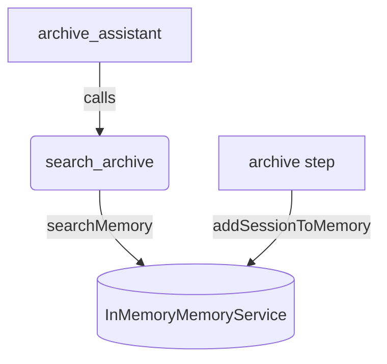

# Runner memory archive

## Overview

`memoryService.addSessionToMemory` hands a finished session to the memory
service, which is what makes the conversation searchable afterwards. This sample
archives a past conversation at startup and then answers questions about it,
because the call produces no output of its own and is invisible without a search
after it.

The archived conversation is a short travel-booking exchange loaded from
`transcript.json`.

## Running

Set `GEMINI_API_KEY`, then run the sample from the repository root:

```bash
npm run sample -- samples/runners/agent.ts
```

The sample also loads in `adk web` from the `samples/` directory, because it
exports `rootAgent`.

To type-check it after an edit, run:

```bash
npm run ts:check:samples
```

`npm run build` does not type-check `samples/`, so this is the command that
catches a type error here.

## Sample Inputs

- `Which hotel am I booked into?`

- `What allergy did I mention?`

- `What is my flight home?`

  _The tool returns the turns that match, and the agent quotes the flight
  number from them._

- `What car did I rent?`

  _Nothing in the archive matches, so the agent reports that rather than
  inventing an answer._

## Graph



## How To

**The memory service is held in a variable, not taken from the runner.** The
archive step writes to `memoryService`, and the tool reads from the same object,
so holding it in a variable is what connects the two halves.

```ts
const memoryService = new InMemoryMemoryService();

const archiveRunner = new Runner({
  appName: APP_NAME,
  agent: rootAgent,
  sessionService: new InMemorySessionService(),
  memoryService,
});
```

**Archiving is one call on a session the caller already holds.** The transcript
is replayed through `appendEvent` here, where a real caller would have run the
conversation with `runAsync` instead.

```ts
await memoryService.addSessionToMemory(session);
```

**The tool searches the archive rather than the current session.** A memory
tool taken from the invocation context would search whichever memory service
the host configured, which under `adk web` is the development server's own.

```ts
const {memories} = await memoryService.searchMemory({
  appName: APP_NAME,
  userId: USER_ID,
  query,
});
```

**The fixture is validated, not cast.** `JSON.parse` returns `any`, so the
transcript goes through a Zod schema that gives it a real type and rejects a
malformed file at startup.

```ts
const transcript = transcriptSchema.parse(
  JSON.parse(readFileSync(transcriptPath, 'utf8')),
);
```

## Related Guides

- [Runner](../../docs/guides/runners/index.md) - Running an agent for an
  application, the entry points, and archiving a finished conversation into
  memory.
