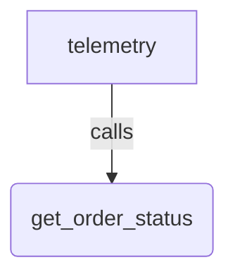

# Telemetry

## Overview

One prompt drives one tool call, and the sample exists to show what ADK records
on the spans around it. The `execute_tool get_order_status` span carries
`gen_ai.system = "gcp.vertex.agent"` and `gcp.vertex.agent.invocation_id`, the
two attributes a trace backend uses to select ADK spans and to group the spans
of one turn.

The sample installs a console span processor with `maybeSetOtelProviders`, so
running it from the CLI prints every span and its attributes.

## Running the Sample

The sample calls a live model. Set `GEMINI_API_KEY`, build once, and run it by
path:

```bash
npm run build
npm run sample -- samples/telemetry/agent.ts
```

`samples/` is not an npm workspace, so `npm run build` does not compile it. It
has its own `samples/tsconfig.json` and is type-checked separately:

```bash
npm run ts:check:samples
```

Lint, Prettier, the license check and `ts:check:samples` read this sample.
Nothing in CI executes it, because
`tests/integration/docs_samples/docs_samples_test.ts` only runs
`samples/workflows`.

## Sample Inputs

- `What is the status of order A-1042?`

- `What is the status of order A-9999?`

  _An identifier the tool does not know. The tool still runs and returns
  `unknown`, so the tool span is emitted either way._

- `Who are you?`

  _No order is named, so the agent answers without the tool and no
  `execute_tool` span appears._

## Graph



## How To

**Install a span processor before the agent runs.** `maybeSetOtelProviders`
runs at module scope, so every span of every later run goes through the
processor.

```ts
maybeSetOtelProviders([
  {spanProcessors: [new SimpleSpanProcessor(new ConsoleSpanExporter())]},
]);
```

**Give the agent one deterministic tool.** A tool the model cannot answer from
its own knowledge makes the tool call, and therefore the tool span, reliable.

```ts
const getOrderStatus = new FunctionTool({
  name: 'get_order_status',
  description: 'Looks up the delivery status of one order by its identifier.',
  parameters: z.object({
    orderId: z.string().describe('The order identifier, such as "A-1042".'),
  }),
  execute: ({orderId}) => ({
    orderId,
    status: ORDER_STATUS[orderId] ?? 'unknown',
  }),
});
```

**Read the span in `adk web`.** The dev server registers its own tracer provider
before it loads this file, and `maybeSetOtelProviders` does not replace one, so
the console exporter prints nothing there. Select the
`execute_tool get_order_status` span in the Trace view to see the same
attributes.

**Turn off message content.** Set `ADK_CAPTURE_MESSAGE_CONTENT_IN_SPANS=false`
and the argument, response and request payloads become `{}` while the
identifying attributes stay.

## Related Guides

- [Telemetry](../../docs/guides/telemetry/index.md) - Every span and attribute ADK writes, the OTLP and Google Cloud exporters, and turning off message content.
