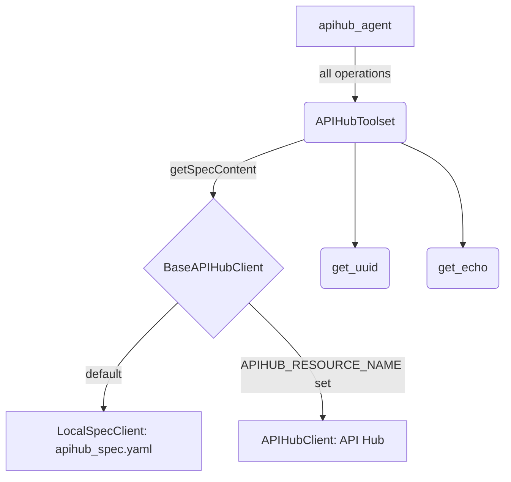

# API Hub tool

## Overview

`APIHubToolset` fetches an OpenAPI spec for an API registered in
[API Hub](https://cloud.google.com/apigee/docs/apihub/what-is-api-hub) and
produces one `RestApiTool` per operation. This sample gives `apihub_agent` the
toolset for an [httpbin](https://httpbin.org) API with two operations.

A real API Hub resource needs a Google Cloud project, so by default the sample
plugs in `LocalSpecClient`. That is a small `BaseAPIHubClient` that returns
`apihub_spec.yaml`, the file beside the agent, for any resource name. Set
`APIHUB_RESOURCE_NAME` to switch to the real `APIHubClient`.

The toolset is built with `lazyLoadSpec: true`, so it fetches the spec on the
agent's first turn rather than when the module loads.

## Requirements

- `GEMINI_API_KEY`, for the model. A `.env` file in the working directory is
  loaded automatically.
- Optional: `APIHUB_RESOURCE_NAME`, an API, API version or API spec in your API
  Hub instance, for example
  `projects/my-project/locations/us-central1/apis/my-api`. An API Hub console
  URL also works.
- Optional, with `APIHUB_RESOURCE_NAME`: `APIHUB_ACCESS_TOKEN`, for example the
  output of `gcloud auth print-access-token`. Without it, the client uses
  application default credentials, which `gcloud auth application-default login`
  sets up.

## Running

Build once, then run the sample:

```bash
npm run build
npm run sample -- samples/tools/apihub_tool/agent.ts
```

To type-check the sample against the built package:

```bash
npm run ts:check:samples
```

## Sample Inputs

These inputs assume the default local spec.

- `give me a random identifier`

  `apihub_agent` calls `get_uuid`, which is `GET https://httpbin.org/uuid`.

- `echo the message hello back to me`

  `apihub_agent` calls `get_echo`, which is
  `GET https://httpbin.org/get?message=hello`. The response repeats the query
  parameters it received.

## Graph



## How To

**Supply a client.** `APIHubToolset` asks its client for the spec content of
`apihubResourceName`. Any object with an async `getSpecContent(path)` method
works, so a stand-in client is a few lines:

```ts
class LocalSpecClient implements BaseAPIHubClient {
  async getSpecContent(_path: string): Promise<string> {
    return readFile(SPEC_PATH, 'utf8');
  }
}
```

**Use API Hub.** Without `apihubClient`, the toolset builds an `APIHubClient`
from `accessToken` or `serviceAccountJson`. The sample builds the client itself
so that it can choose between the two clients:

```ts
const apihubToolset = new APIHubToolset({
  apihubResourceName:
    resourceName ?? 'projects/local/locations/local/apis/httpbin',
  apihubClient: resourceName
    ? new APIHubClient({accessToken: process.env.APIHUB_ACCESS_TOKEN})
    : new LocalSpecClient(),
  lazyLoadSpec: true,
});
```

A resource name that names an API resolves to the first spec of its first
version. Name a version or a spec to pick a different one.

**Load lazily.** Without `lazyLoadSpec`, the toolset starts the fetch in its
constructor. With it, the fetch waits for the first `getTools` call, and a
failure is reported on that call. A failed lazy fetch is tried again on the
next call.

## Related Guides

- [API Hub tool](../../../docs/guides/tools/apihub_tool/index.md) - Building a toolset from an API Hub resource, the accepted resource names, custom clients and `SecretManagerClient`.
- [OpenAPI tool](../../../docs/guides/tools/openapi_tool/index.md) - The toolset that `APIHubToolset` hands the spec to, and how a credential reaches the request.
