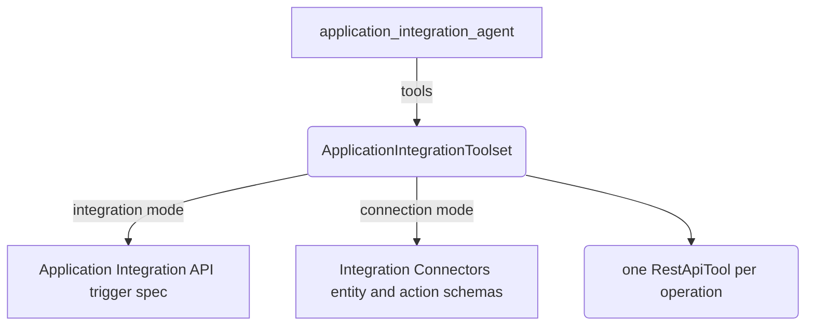

# Application Integration tool

## Overview

`ApplicationIntegrationToolset` turns a Google Cloud resource into a set of
`RestApiTool`s. This sample gives one agent the tools of either an Application
Integration API trigger, or the entities and actions of an Integration
Connectors connection, and picks the mode from environment variables.

Constructing the toolset only checks the options. The toolset fetches the
spec and builds the tools the first time the agent asks for them, which is at
the start of the first turn, and keeps them for later turns.

## Requirements

- `GEMINI_API_KEY`, for the model.
- A Google Cloud project, named by `GOOGLE_CLOUD_PROJECT`. Set
  `GOOGLE_CLOUD_LOCATION` when the resources are not in `us-central1`.
- Application Default Credentials that can read the integration or the
  connection: run `gcloud auth application-default login`, or set
  `GOOGLE_APPLICATION_CREDENTIALS` to a service-account key file. The spec
  requests and the generated tools both use them.
- One of the two modes:

  | Mode        | Variables                                                                  |
  | ----------- | -------------------------------------------------------------------------- |
  | Integration | `INTEGRATION_NAME` and `INTEGRATION_TRIGGER`, such as `api_trigger/orders` |
  | Connection  | `CONNECTION_NAME`, and `CONNECTION_ENTITIES`, `CONNECTION_ACTIONS` or both |

  `CONNECTION_ENTITIES` and `CONNECTION_ACTIONS` are comma-separated lists,
  such as `Issues,Projects` and `ExecuteCustomQuery`.

- Connection mode also needs an integration named `ExecuteConnection`, with
  the API trigger `api_trigger/ExecuteConnection`, in the same project and
  region as the connection. Every generated tool calls that integration.

## Running

Build once, then run the sample:

```bash
npm run build
export GOOGLE_CLOUD_PROJECT=my-project
export CONNECTION_NAME=my-connection
export CONNECTION_ENTITIES=Issues
npm run sample -- samples/tools/application_integration_tool/agent.ts
```

`adk web` also runs it, because `agent.ts` exports `rootAgent`.

To type-check the sample without running it:

```bash
npm run ts:check:samples
```

## Sample Inputs

- `what can you do?`

  The agent lists the tools the toolset generated, one per operation of the
  trigger, or one per entity operation and action of the connection.

- `list the first five Issues`

  In connection mode with `CONNECTION_ENTITIES=Issues`, the agent calls the
  list tool of the `Issues` entity with a page size of 5.

- `run the query SELECT * FROM Issues LIMIT 5`

  In connection mode with `CONNECTION_ACTIONS=ExecuteCustomQuery`, the agent
  calls the custom query tool.

## Graph



## How To

**Pick the mode with the options you set.** An integration and a trigger
select integration mode. A connection with entity operations, actions, or
both selects connection mode. The constructor throws for anything else, so a
missing variable fails when the module loads, not in the middle of a turn.

```ts
const applicationIntegrationToolset = new ApplicationIntegrationToolset({
  project,
  location: process.env.GOOGLE_CLOUD_LOCATION ?? 'us-central1',
  integration: process.env.INTEGRATION_NAME,
  trigger: process.env.INTEGRATION_TRIGGER,
  connection: process.env.CONNECTION_NAME,
  entityOperations,
  actions: listFromEnv('CONNECTION_ACTIONS'),
});
```

**Expose every operation of an entity with an empty list.** The toolset asks
Integration Connectors which operations the entity supports and uses all of
them. Name the operations, such as `{Issues: ['LIST', 'GET']}`, to expose
fewer.

```ts
const entityOperations = Object.fromEntries(
  listFromEnv('CONNECTION_ENTITIES').map((entity) => [entity, []]),
);
```

**Put the toolset into `tools` whole.** `tools` accepts a `BaseToolset`, and
the agent sees one function declaration per generated tool.

```ts
tools: [applicationIntegrationToolset],
```

## Related Guides

- [Application Integration tool](../../../docs/guides/tools/application_integration_tool/index.md) - The two modes, every option, how the credential is chosen, and the limits of the toolset.
- [OpenAPI tool](../../../docs/guides/tools/openapi_tool/index.md) - The toolset that turns the generated spec into tools.
