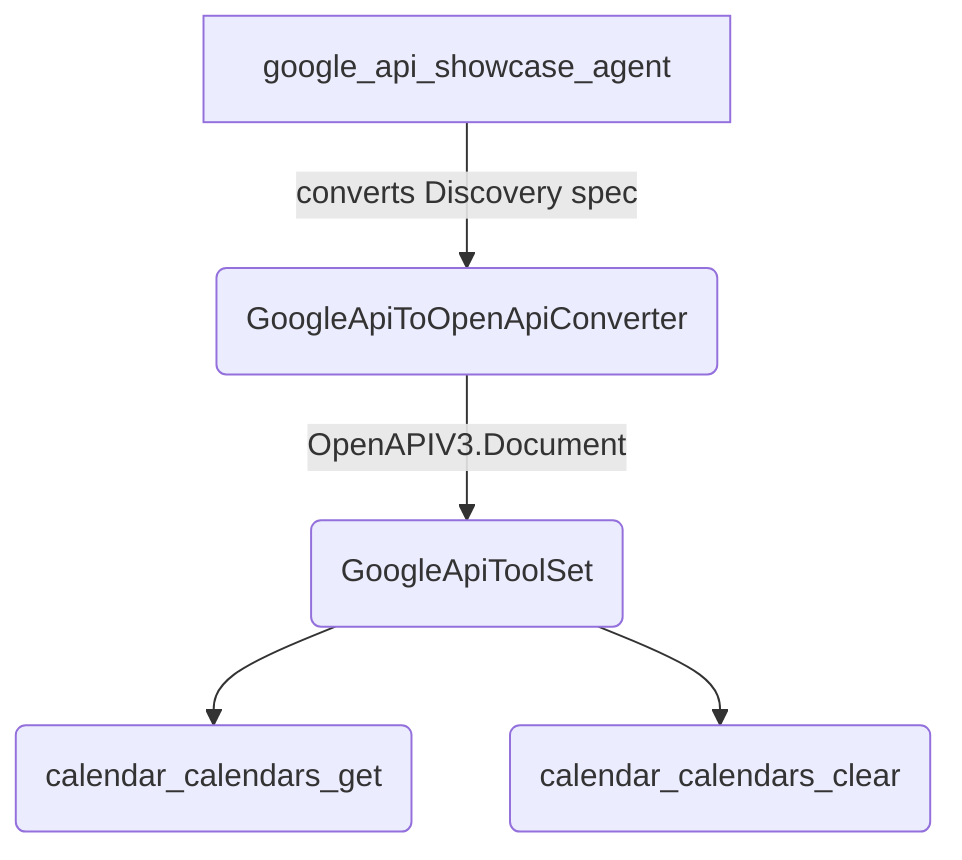

# Google API tool

## Overview

`GoogleApiToOpenApiConverter` converts a Google Discovery REST specification into an OpenAPI v3.0.0 document, and `GoogleApiToolSet` wraps the resulting operations in `GoogleApiTool` instances configured with Google OpenID Connect authentication. This sample runs the conversion, OpenID Connect toolset construction, tool filtering, and credential configuration offline through a deterministic `BaseAgent` subclass.

## Sample Inputs

- `Show me the Google API toolset`

  _Any message works. The agent converts `calendar_discovery_spec.json`, inspects the resulting `GoogleApiToolSet`, and replies with a report._

## Graph



## Running the Sample

The sample runs offline and requires no API key, network access, or optional peer dependency. Build the workspace once, then run the exported `rootAgent` through the ADK CLI:

```bash
npm run build
npm run sample -- samples/tools/google_api_tool/agent.ts
```

`samples/` is not an npm workspace, so type-check it separately:

```bash
npm run ts:check:samples
```

## How To

**Convert a Google Discovery specification into an OpenAPI v3 document.** `GoogleApiToOpenApiConverter` fetches the Discovery specification by API name and version or converts an already-loaded `googleApiSpec` object read from `calendar_discovery_spec.json`:

```ts
const CALENDAR_DISCOVERY_SPEC = JSON.parse(
  readFileSync(
    join(
      dirname(fileURLToPath(import.meta.url)),
      'calendar_discovery_spec.json',
    ),
    'utf8',
  ),
) as GoogleApiSpec;

const converter = new GoogleApiToOpenApiConverter('calendar', 'v3');
converter.googleApiSpec = CALENDAR_DISCOVERY_SPEC;
const openApiSpec = await converter.convert();
```

**Build an OpenID Connect toolset and wrap its tools.** `GoogleApiToolSet.loadToolSetWithOidcAuth` attaches Google's OpenID Connect endpoints and scopes to an `OpenAPIToolset`, and `GoogleApiToolSet` wraps the `RestApiTool` instances in `GoogleApiTool`:

```ts
const oidcToolset = GoogleApiToolSet.loadToolSetWithOidcAuth({
  specDict: openApiSpec,
  scopes: scope ? [scope] : [],
});
const restTools = ['calendar_calendars_get', 'calendar_calendars_clear']
  .map((name) => oidcToolset.getTool(name))
  .filter((tool): tool is RestApiTool => tool !== undefined);
const toolSet = new GoogleApiToolSet(restTools);
```

**Filter exposed tools and configure OAuth 2.0 client credentials.** Passing `toolFilter` to `new GoogleApiToolSet(tools, {toolFilter})` narrows what `getTools()` exposes to an agent, while `getTool(name)` still resolves any operation in the toolset by its `snake_case` name. `configureAuth` applies the client ID and client secret to every `GoogleApiTool` in the set:

```ts
const toolSet = new GoogleApiToolSet(restTools, {
  toolFilter: ['calendar_calendars_get'],
});
toolSet.configureAuth(PLACEHOLDER_CLIENT_ID, PLACEHOLDER_CLIENT_SECRET);
```

## Related Guides

- [Google API tool](../../../docs/guides/tools/google_api_tool/index.md) - Converting Google Discovery specifications into `GoogleApiToolSet` instances and configuring OpenID Connect credentials.
- [OpenAPI tool](../../../docs/guides/tools/openapi_tool/index.md) - Turning an OpenAPI v3 document into `RestApiTool` instances with `OpenAPIToolset`.
