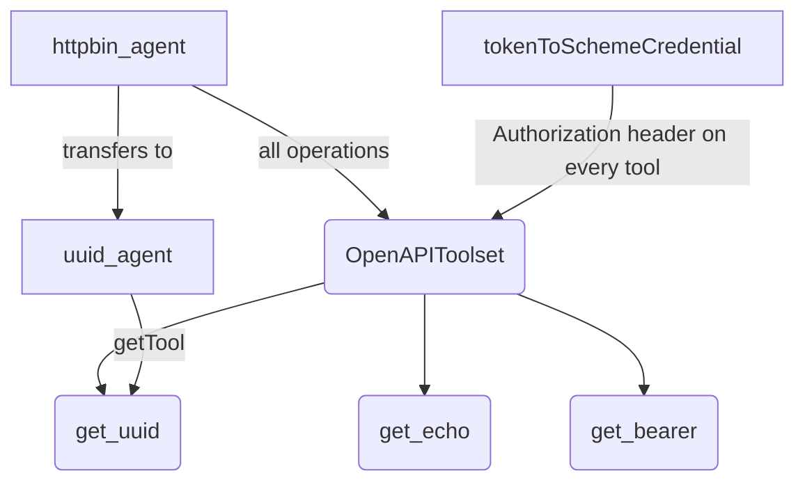

# OpenAPI tool

## Overview

`OpenAPIToolset` reads an OpenAPI v3 document and produces one `RestApiTool`
per operation. This sample builds a toolset from `httpbin_spec.yaml`, a document
for [httpbin](https://httpbin.org) that sits beside the agent, and runs the whole
feature from that one spec:
the whole toolset on `httpbin_agent`, one tool selected by name with `getTool`
on its sub-agent `uuid_agent`, and an authenticated call whose credential comes
from `tokenToSchemeCredential`.

httpbin issues no credentials of its own — its `/bearer` endpoint answers 401
without an `Authorization` header and echoes the token back with one — so the
sample authenticates with a stand-in token and needs no account anywhere. Set
`HTTPBIN_TOKEN` to change it.

## Sample Inputs

- `give me a random identifier`

  `httpbin_agent` transfers to `uuid_agent`, which calls `get_uuid`, which is
  `GET https://httpbin.org/uuid`. That agent holds one tool, selected out of
  the toolset by name.

- `echo the message hello back to me`

  `httpbin_agent` calls `get_echo`, which is
  `GET https://httpbin.org/get?message=…`. The response repeats the query
  parameters it received.

- `check whether my request is authenticated`

  `httpbin_agent` calls `get_bearer`, which is `GET https://httpbin.org/bearer`.
  The response is `{"authenticated": true, "token": "demo-openapi-token"}`,
  which is the toolset's credential coming back off the wire.

## Graph



## How To

**Read the spec, then build the toolset from it.** The document is a file
rather than a string literal, which is how a caller actually gets one:

```ts
const HTTPBIN_SPEC = readFileSync(
  join(dirname(fileURLToPath(import.meta.url)), 'httpbin_spec.yaml'),
  'utf8',
);
```

`specType` names the format. The toolset throws
`Unsupported spec type: <value>` for anything other than `json` or `yaml`, so a
wrong format reports the argument rather than a parse error.

```ts
const httpbinToolset = new OpenAPIToolset({
  specStr: HTTPBIN_SPEC,
  specType: 'yaml',
  authScheme,
  authCredential,
});
```

**Build the scheme and the credential together.** The two halves have to agree
on where the credential goes, so the helper returns both rather than leaving a
caller to match them. `'oauth2Token'` yields a bearer scheme and an HTTP bearer
credential; `'apikey'` with a location and a name yields an API key in a
header, a query parameter or a cookie.

```ts
const [authScheme, authCredential] = tokenToSchemeCredential(
  'oauth2Token',
  undefined,
  undefined,
  process.env.HTTPBIN_TOKEN ?? 'demo-openapi-token',
);
```

The pair is a toolset-wide override, applied after parsing to every tool the
spec produced. Give each service its own toolset when they need different
credentials.

**Give an agent every operation.** A `BaseToolset` goes straight into `tools`,
and the agent sees one function declaration per operation.

```ts
tools: [httpbinToolset],
```

**Give a sub-agent one operation.** `getTool` returns the parsed tool or
`undefined`, so the sample fails at startup when the spec changes and the name
no longer resolves.

```ts
const uuidTool = httpbinToolset.getTool('get_uuid');
if (!uuidTool) {
  throw new Error('The httpbin spec did not produce a get_uuid tool.');
}
```

The name to pass is the one the toolset stored. adk-js derives it from the
`operationId`, so `getUuid` becomes `get_uuid`. A toolset built with `prefix`
stores the prefixed name, and that is what `getTool` matches.

**A failing call is a result, not an exception.** A non-2xx response comes back
as `{error: "Tool <name> execution failed. …"}`, so the model reads the failure
and can retry or report it. Say in the instruction what the agent should do
with it.

## Related Guides

- [OpenAPI tool](../../../docs/guides/tools/openapi_tool/index.md) - Turning an OpenAPI spec into tools: the toolset, the tools it builds, and how a credential reaches the request.
