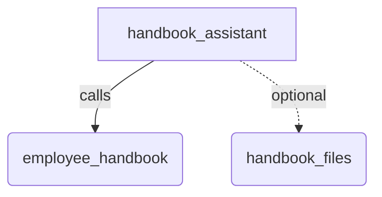

# Retrieval

## Overview

A grounded question-answering agent built on `LlamaIndexRetrieval`. The model
sends one natural-language `query`, the framework runs the retrieval
client-side, and the model sees only the chunk the retriever picked — never the
corpus.

The sample ships its corpus as an array in the file rather than an index,
because `LlamaIndexRetrieval` accepts any object with a `retrieve(query)`
method. That keeps the sample runnable without the optional `llamaindex`
package. `FilesRetrieval`, the subclass that does need it, is wired up behind an
environment variable so the sample still runs when it is absent.

## Sample Inputs

- `how long do I have to file an expense report?`

- `what laptop am I entitled to?`

- `who approves international travel?`

  _Three policies mention approval. The tool answers with the text of the single
  highest-scoring node, matching adk-python, so the answer comes from whichever
  chunk `KeywordRetriever` ranks first._

## Graph



The dotted edge is present only when `ADK_SAMPLE_DOCS_DIR` is set.

## How To

**A retriever is any object with `retrieve`.** `LlamaIndexRetrieval` types its
retriever structurally and nothing in the module imports `llamaindex`, so a
hand-written class satisfies it.

```ts
class KeywordRetriever implements LlamaIndexRetriever {
  async retrieve(query: string): Promise<LlamaIndexNodeWithScore[]> {
    // score every entry, then sort
  }
}
```

**Sort your results.** The tool returns the first node, not the best one — it
trusts the retriever's ordering and never re-ranks. A retriever that returns
results unsorted decides the answer by accident.

```ts
    .sort((a, b) => b.score - a.score);
```

**The description is the routing signal.** It is the only thing the model has to
decide whether to call the tool, so it states what the corpus contains rather
than naming the tool again.

## How To Run

Requires an API key, because the agent calls a live model. Nothing else.

```bash
export GEMINI_API_KEY=...
npm run sample -- samples/tools/retrieval/agent.ts
```

## Configuration

The sample is self-contained. `employee_handbook` reads a corpus declared in
`agent.ts`, and `local_docs` indexes `documents/`, which ships beside the
agent. Both work out of the box.

| Setting               | Default                       | What it changes                                                                        |
| --------------------- | ----------------------------- | -------------------------------------------------------------------------------------- |
| `GEMINI_API_KEY`      | none, required                | The model the agent calls.                                                             |
| `ADK_SAMPLE_DOCS_DIR` | `documents/` beside the agent | The directory `local_docs` indexes. Point it at your own files to search them instead. |

### The two tools, and why there are two

`employee_handbook` uses `LlamaIndexRetrieval` over a hand-written retriever,
so it demonstrates the interface without any index at all. `local_docs` uses
`FilesRetrieval`, which builds a real vector index from a directory.

Only the second needs anything installed:

```bash
npm install llamaindex @llamaindex/readers
```

Those are peer dependencies of `FilesRetrieval`, not of `@google/adk`. Without
them the sample prints a line saying `local_docs` is off and runs with
`employee_handbook` alone, so the interesting half is never blocked by a
package you have not installed. `FilesRetrieval.create` also needs a configured
LlamaIndex embedding model; `VectorStoreIndex.fromDocuments` fails without one,
and that failure is caught the same way.

### Changing the corpus

To search your own documents, point `ADK_SAMPLE_DOCS_DIR` at a directory:

```bash
export ADK_SAMPLE_DOCS_DIR=/path/to/your/docs
```

To change what `employee_handbook` knows, edit the `HANDBOOK` array in
`agent.ts`. It is deliberately three strings rather than a file, so the
retriever interface stays the subject.

## Related Guides

- [LlamaIndexRetrieval](../../../docs/guides/tools/retrieval/llama_index_retrieval/index.md) - The class this sample is built on.
- [FilesRetrieval](../../../docs/guides/tools/retrieval/files_retrieval/index.md) - The optional half, and its peer dependencies.
- [BaseRetrievalTool](../../../docs/guides/tools/retrieval/base_retrieval_tool/index.md) - How client-side retrieval differs from `VertexRagRetrievalTool`.
